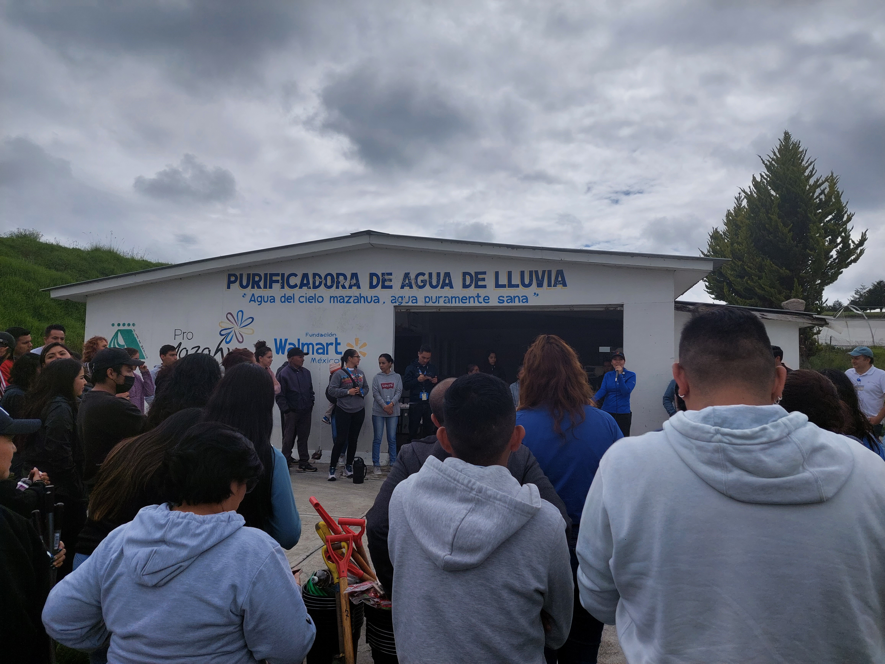
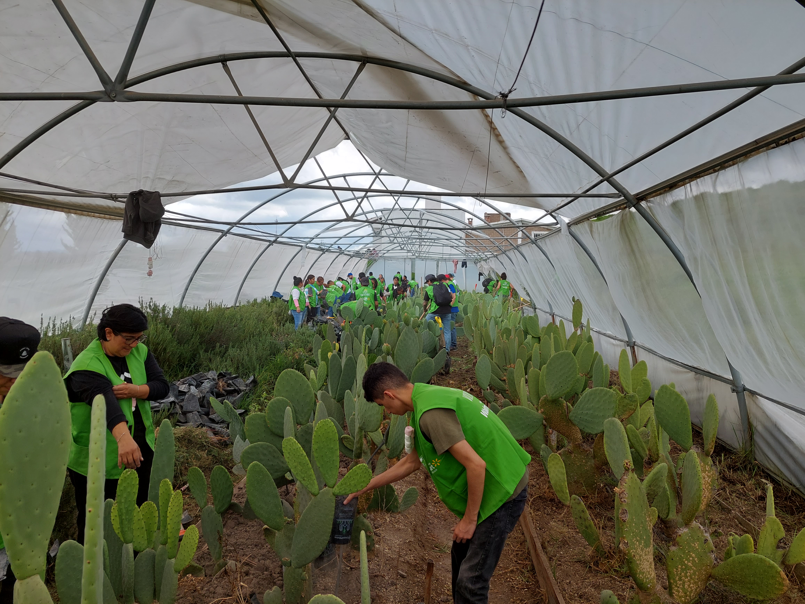
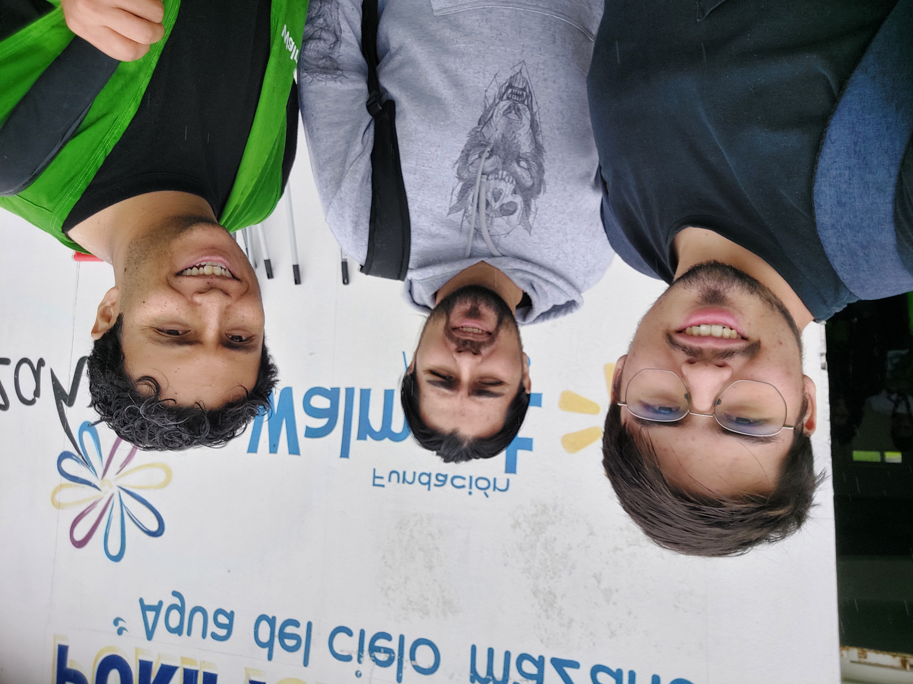

# Plan de Revamp — Portfolio de Arturo Casillas Díaz

> **Instrucciones para el agente ejecutor:** Este documento es autocontenido. Ejecuta las fases EN ORDEN. Al terminar cada fase, verifica los "Criterios de aceptación" antes de continuar. No inventes contenido nuevo (métricas, fechas, puestos): usa ÚNICAMENTE los textos provistos aquí. Si algo es ambiguo, detente y pregunta al usuario.

## Contexto general

- **Proyecto:** portfolio personal de una sola página, en `index.html` (raíz del repo).
- **Hosting:** GitHub Pages (sitio estático). PROHIBIDO: backend, npm/node builds, frameworks que requieran compilación. Toda librería nueva se carga por CDN.
- **Stack actual:** HTML + Bootstrap (en `lib/bootstrap/`), jQuery (`lib/jquery/`), Font Awesome (`lib/font-awesome/`), CSS propio en `css/style.css`, JS propio en `js/main.js`.
- **Estilo actual:** paleta oscura (#111, #2f2f2f, #2c3e50) con acento verde-turquesa (#44bbaa / #1abc9c). Fuentes: Lato (cuerpo) y Raleway (títulos), cargadas por Google Fonts. **Mantener esta paleta y fuentes.**
- **Dato clave del usuario:** su puesto actual es **SDE II, Analytics Engineering en Pinterest** (desde Jun 2025). Este rol debe ser EL protagonista del sitio.
- **Inspiración de diseño:** https://natassha.github.io/natasshaselvaraj/ (single-page, tarjetas con imagen + botones de acción, hero con slider, nav con links sociales).

## Cómo probar localmente

Servir la raíz del repo con un servidor estático, por ejemplo:

```bash
python3 -m http.server 8080
```

y abrir `http://localhost:8080`. Verificar siempre en viewport desktop (~1280px) y mobile (~375px).

---

## Fase 1 — Corrección de titular y narrativa

**Objetivo:** que el sitio comunique de inmediato el rol actual: SDE II, Analytics Engineering @ Pinterest.

### Pasos

1. En `index.html`, dentro de `#headerwrap`, localizar:
   ```html
   <h3>Sr. Analytics Engineer | Data Scientist | casillas.arturo@proton.me</h3>
   ```
   Reemplazar por:
   ```html
   <h3>SDE II, Analytics Engineering @ Pinterest</h3>
   <h4>casillas.arturo@proton.me</h4>
   ```
   Si `<h4>` dentro de `#headerwrap` no tiene estilo, agregar en `css/style.css` una regla que lo muestre en blanco/gris claro, tamaño menor que el h3, con margen superior pequeño.

2. En la sección `#about`, reemplazar el párrafo del "About me" por:
   ```html
   <p> I'm a Software Development Engineer II in Analytics Engineering at Pinterest.
     I design and build scalable data pipelines, source-of-truth datasets, and analytics
     tooling that teams across the organization trust to make decisions — working mainly
     with Python, SQL, Airflow, and DBT.
     When I'm not working, you can find me exploring the latest advancements in data
     engineering and machine learning.
   </p>
   ```

3. En la sección de experiencia, en la entrada de Pinterest, cambiar el título del puesto de `Analytics Engineer` a `SDE II — Analytics Engineering`.

4. Actualizar el `<title>` de la página a: `Arturo Casillas Díaz — Analytics Engineering` y llenar la meta description:
   ```html
   <meta content="Arturo Casillas Díaz — SDE II, Analytics Engineering at Pinterest. Data pipelines, analytics tooling, Python, SQL, Airflow, DBT." name="description">
   ```

### Criterios de aceptación
- El header muestra "SDE II, Analytics Engineering @ Pinterest".
- No queda ninguna mención "Sr. Analytics Engineer" ni "Data Analyst | Data Scientist" en el header.
- El about habla del rol en Pinterest en primera línea.

---

## Fase 2 — Tarjeta destacada para Pinterest (Experience)

**Objetivo:** separar el trabajo actual del resto del timeline y darle protagonismo visual.

### Pasos

1. En `index.html`, en el contenedor de experiencia (`<!--WORK DESCRIPTION -->`), extraer la entrada de Pinterest de la lista y colocarla ANTES de las demás dentro de una tarjeta destacada:

   ```html
   <div class="col-lg-9 col-lg-offset-3">
     <div class="current-role-card">
       <span class="current-badge">CURRENT ROLE</span>
       <h4>SDE II — Analytics Engineering</h4>
       <h5 class="company">Pinterest · Mexico City</h5>
       <sm>JUN 2025 - Present</sm>
       <ul class="role-highlights">
         <li>Build and maintain scalable data pipelines and source-of-truth datasets used across the organization.</li>
         <li>Develop dashboards and reporting solutions that enable data-driven decision-making for stakeholders.</li>
         <li>Automate workflows with Airflow, Python, and SQL, improving data reliability and reducing manual effort.</li>
         <li>Partner with cross-functional teams to design, validate, and deliver trusted data products.</li>
       </ul>
     </div>
   </div>
   ```

2. Agregar a `css/style.css`:

   ```css
   .current-role-card {
     background: #2c3e50;
     border-left: 5px solid #44bbaa;
     border-radius: 6px;
     padding: 24px 28px;
     margin-bottom: 30px;
     color: #ecf0f1;
   }
   .current-role-card h4 {
     font-family: "Raleway";
     color: #fff;
     margin: 8px 0 2px 0;
   }
   .current-role-card .company {
     color: #44bbaa;
     margin: 0 0 6px 0;
   }
   .current-badge {
     display: inline-block;
     background: #44bbaa;
     color: #fff;
     font-size: 11px;
     letter-spacing: 2px;
     padding: 3px 10px;
     border-radius: 3px;
   }
   .role-highlights {
     margin: 12px 0 0 0;
     padding-left: 18px;
   }
   .role-highlights li {
     margin-bottom: 6px;
     color: #bdc3c7;
   }
   ```

3. Las entradas restantes (DiDi, Stori, Walmart, Intel, Dr Envio, Nielsen x2) se quedan en el formato actual, debajo de la tarjeta. NO cambiar sus textos ni fechas.

### Criterios de aceptación
- Pinterest aparece primero, dentro de una tarjeta con fondo oscuro, borde izquierdo turquesa y badge "CURRENT ROLE".
- Los demás trabajos siguen visibles debajo en el formato anterior.
- En mobile (375px) la tarjeta no desborda horizontalmente.

---

## Fase 3 — Galería de fotos con grid + lightbox

**Objetivo:** reemplazar las imágenes sueltas de "Volunteer Work" (hoy con `style="width:40%"` inline) por un grid responsivo con lightbox al hacer clic.

### Pasos

1. Agregar GLightbox por CDN. En el `<head>` de `index.html`:
   ```html
   <link rel="stylesheet" href="https://cdn.jsdelivr.net/npm/glightbox@3.3.0/dist/css/glightbox.min.css">
   ```
   Antes de `</body>` (después de los demás scripts):
   ```html
   <script src="https://cdn.jsdelivr.net/npm/glightbox@3.3.0/dist/js/glightbox.min.js"></script>
   <script> const lightbox = GLightbox({ selector: '.glightbox' }); </script>
   ```

2. En la sección `#work` (Volunteer Work), reemplazar cada bloque de `` sueltos por un grid. Ejemplo para el evento Mazahua 2023 (repetir el patrón para el de Tepotzotlán 2022 con sus imágenes):

   ```html
   <div class="photo-grid">
     <a href="img/20230817_061313.jpg" class="glightbox" data-gallery="mazahua-2023">
       
     </a>
     <a href="img/20230817_095201.jpg" class="glightbox" data-gallery="mazahua-2023">
       
     </a>
     <a href="img/20230817_121603.jpg" class="glightbox" data-gallery="mazahua-2023">
       
     </a>
     <a href="img/20230817_131905.jpg" class="glightbox" data-gallery="mazahua-2023">
       
     </a>
   </div>
   ```

   Imágenes del evento Tepotzotlán 2022 (usar `data-gallery="tepotzotlan-2022"`): `img/20220902_110118.jpg`, `img/20220902_110135.jpg`, `img/20220902-WA0006.jpg`. Alt sugeridos: "Volunteers planting trees in Tepotzotlán", "Reforestation activity in Tepotzotlán", "Walmart volunteer team at reforestation site".

3. Agregar a `css/style.css`:

   ```css
   .photo-grid {
     display: grid;
     grid-template-columns: repeat(auto-fill, minmax(140px, 1fr));
     gap: 10px;
     margin: 12px 0 16px 0;
   }
   .photo-grid img {
     width: 100%;
     height: 140px;
     object-fit: cover;
     border-radius: 6px;
     display: block;
     transition: transform 0.2s ease, opacity 0.2s ease;
   }
   .photo-grid a:hover img {
     transform: scale(1.03);
     opacity: 0.85;
   }
   ```

4. Eliminar todos los atributos `style="width:40%; margin-bottom:10px;"` inline de esas imágenes (quedan cubiertos por el CSS del grid).

### Criterios de aceptación
- Las fotos se muestran en un grid uniforme (celdas del mismo alto, recortadas con `object-fit: cover`).
- Al hacer clic en una foto se abre en un modal a pantalla completa con flechas para navegar dentro del mismo evento.
- Las fotos de Mazahua y Tepotzotlán navegan en galerías separadas.
- Ningún error en la consola del navegador relacionado con GLightbox.

---

## Fase 4 — Limpieza de JS y nav social

**Objetivo:** quitar código muerto y acercar el nav al patrón del sitio de inspiración.

### Pasos

1. En `js/main.js`, eliminar TODOS los bloques de doughnut charts (los que llaman `new Chart(document.getElementById("python")...)`, `"power bi"`, `"bootstrap"`, `"wordpress"`, `"html"`, `"excel"`, `"pandas"`, etc.). Esos `<canvas>` ya no existen en el HTML (están comentados) y generan errores de consola. Conservar: el bloque de smooth scroll y el init del carousel.
2. Verificado el paso 1, eliminar también la carga de `lib/chart/chart.js` en `index.html` (la línea `<script src="lib/chart/chart.js"></script>`), ya que nada la usa.
3. En el nav superior (`#nav`), agregar dos items al final con links sociales, siguiendo el formato existente de `<li class="menu-item">`:
   ```html
   <li class="menu-item"><a href="https://github.com/Escannor" target="_blank" title="GitHub"><i class="fa fa-github"></i></a></li>
   <li class="menu-item"><a href="https://www.linkedin.com/in/arturo-casillas-diaz/" target="_blank" title="LinkedIn"><i class="fa fa-linkedin"></i></a></li>
   ```
   Nota: estos dos NO llevan la clase `smothscroll` (son links externos).

### Criterios de aceptación
- Consola del navegador sin errores al cargar la página.
- `js/main.js` conserva smooth scroll y carousel, sin referencias a `Chart`.
- El nav muestra íconos de GitHub y LinkedIn que abren en pestaña nueva.

---

## Fase 5 — Accesibilidad y detalles

### Pasos

1. Revisar que TODAS las `` del sitio tengan `alt` descriptivo (no "Image 1 description"). Las de la galería quedaron cubiertas en Fase 3.
2. Agregar `loading="lazy"` a toda imagen que esté debajo del primer viewport.
3. Verificar que los links de certificaciones (DataCamp, Coursera, HackerRank) respondan 200 (abrir cada uno).
4. En el footer/contact, verificar que el email mostrado (`casillas.arturo@proton.me`) y los links sociales coincidan con los del nav.

### Criterios de aceptación
- Sin `alt` genéricos ni vacíos.
- Links externos funcionan.

---

## Fase 6 — Verificación final y despliegue

### Pasos

1. Servir localmente y revisar la página completa en 1280px y 375px: sin overflow horizontal, sin errores de consola, lightbox funcional, tarjeta de Pinterest visible arriba de Experience.
2. Ejecutar `git status` y revisar el diff completo (`git diff index.html css/style.css js/main.js`).
3. Hacer commit en la rama actual (`pinterest-update`) con mensaje descriptivo, por ejemplo: `Revamp: Pinterest SDE II spotlight, photo grid gallery with lightbox, JS cleanup`.
4. NO hacer push ni merge a `main` sin confirmación explícita del usuario (GitHub Pages publica desde `main`).

### Criterios de aceptación
- Todos los criterios de las fases anteriores se cumplen.
- Commit creado; push pendiente de aprobación del usuario.

---

## Fuera de alcance (NO hacer)

- No migrar a ningún framework (React, Jekyll con plugins custom, etc.).
- No borrar las secciones Awards, Education ni Contact.
- No cambiar la paleta de colores ni las fuentes.
- No comprimir/convertir imágenes a WebP en esta iteración (queda para una fase futura; requiere aprobación del usuario porque reemplaza archivos binarios).
- No tocar `contactform/` (el form PHP no funciona en GitHub Pages de todos modos, pero su reemplazo se decidirá con el usuario más adelante).
